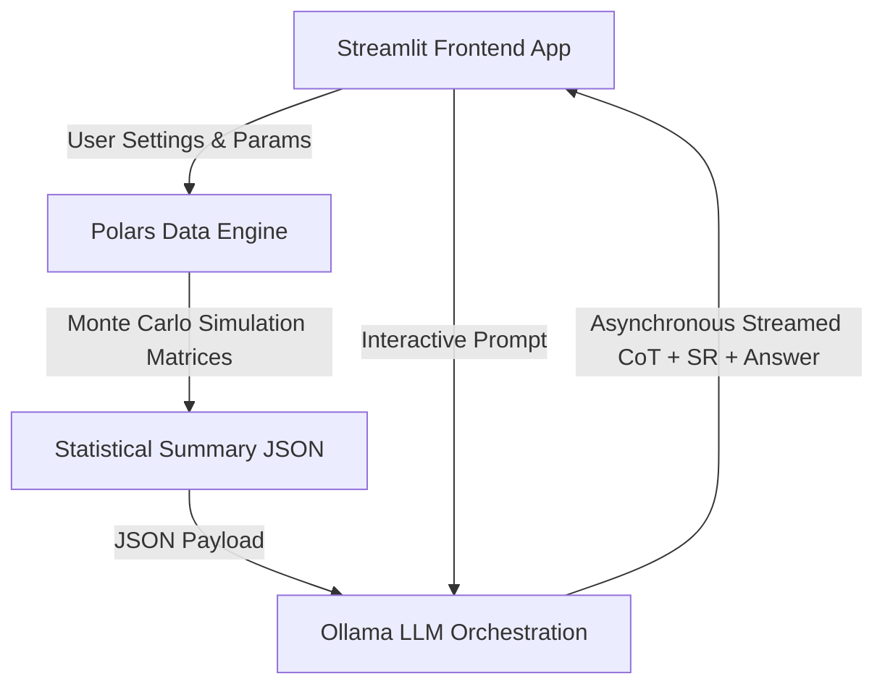

# MEST: Macro-Economic Scenario Tester

[](https://www.python.org/)
[](https://opensource.org/licenses/MIT)
[](https://streamlit.io/)
[](https://pola.rs/)
[](https://ollama.com/)

MEST (Macro-Economic Scenario Tester) is a high-performance, privacy-first, local-first decumulation stress-testing analytics application. It allows you to model custom phased retirement withdrawals (such as early-retirement bridge periods) and stress-test them against stochastic Monte Carlo distributions or 150+ years of historical U.S. economic data.

Additionally, MEST integrates with local Ollama instances to run an **AI Scenario Analyst** which utilizes a structured cognitive reasoning architecture (Chain of Thought & Self-Reflection) to generate plain-English risk assessments.

---

## 🌟 Key Features

1. **High-Performance Math Engine:** Vectorized Monte Carlo and historical bootstrap simulations powered by [Polars](https://pola.rs/) executing 10,000 paths in under **0.1 seconds**.
2. **Dual Simulation Modes:**
   - **Monte Carlo Stochastic:** Generates paths using lognormal stock return distributions parameterized by expected return, volatility, and inflation.
   - **Historical Bootstrap:** Randomly samples monthly returns with replacement from actual U.S. stock (S&P 500 total return), CPI inflation, and bond yield data dating back to **1871**.
3. **Phased Retirement Modeling:** Flexible inputs for an early retirement **"Bridge Period"** (configured by month duration and a bridge withdrawal amount) followed by a **"Post-Bridge Period"** withdrawal amount.
4. **AI Scenario Analyst:** 
   - Uses local LLMs (like `llama3` or `gemma4:e2b`) via Ollama.
   - Implements a cognitive reasoning loop: **Decomposed Query Parsing** (for long inputs) $\rightarrow$ **Chain of Thought (CoT)** reasoning $\rightarrow$ **Self-Reflection (SR)** verification.
   - Delivers real-time streaming updates into Streamlit with thoughts, reflections, and final analysis blocks.
5. **Interactive Data Visualization:** Dynamic Altair charts for 100 sample portfolio paths showing successful outcomes (blue) vs failures/depletions (red) with zoom, pan, and hover support.

---

## 🏗️ System Architecture

MEST is designed with a decoupled, three-tier, local-first analytical layout:



### Module File References
* **Frontend UI:** [dashboard.py](file:///Users/yiannis/Projects/myFinances/mest/src/mest/ui/dashboard.py) manages the sliders, layouts, and sessions.
* **Math Engine:** [simulator.py](file:///Users/yiannis/Projects/myFinances/mest/src/mest/core/simulator.py) handles Monte Carlo calculations and historical bootstrap distributions.
* **AI Orchestrator:** [orchestrator.py](file:///Users/yiannis/Projects/myFinances/mest/src/mest/llm/orchestrator.py) manages prompts, parses XML tags, and streams LLM output.
* **Scenario Classifier:** [classifier.py](file:///Users/yiannis/Projects/myFinances/mest/src/mest/llm/classifier.py) deterministically classifies economic regimes.

---

## 🚀 Quick Start

### 1. Prerequisites
- **Python 3.12+**
- **`uv` Package Manager:** [astral-sh/uv](https://github.com/astral-sh/uv)
- **Ollama (Optional):** Download from [ollama.com](https://ollama.com) and ensure the service is running. Pull a model of your choice, e.g.:
  ```bash
  ollama pull gemma4:e2b
  ```

### 2. Setup & Installation
Clone the repository and install all dependencies in a virtual environment via `uv`:
```bash
cd /path/to/myFinances/mest
uv sync
```

### 3. Launching the App
Start the local Streamlit server:
```bash
uv run streamlit run src/mest/ui/dashboard.py
```
This will automatically launch the dashboard in your default browser at `http://localhost:8501`.

---

## 🧪 Running Tests

The project is backed by a robust test suite covering mathematical edge cases, regime classification rules, and mocked LLM streams. Run the tests using:
```bash
uv run pytest
```

---

## 📖 Learn More
For detailed guides on how to configure decumulation parameters, navigate the UI widgets, or configure the AI Analyst model dropdown, check out the comprehensive [MEST User Manual](file:///Users/yiannis/Projects/myFinances/mest/MANUAL.md).
