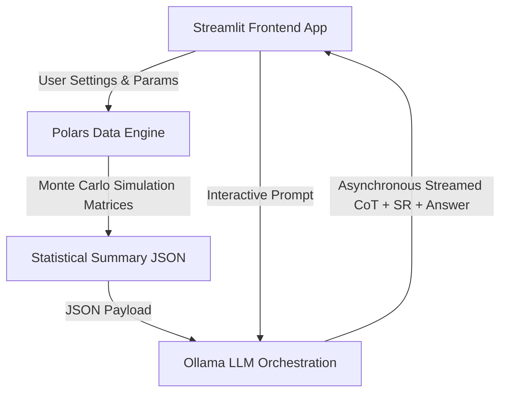

# SPEC.md: Technical Specification for MEST

This document is the ultimate source of truth for the architectural design, API contracts, data schemas, and implementation plan for the **Macro-Economic Scenario Tester (MEST)**.

---

## 1. System Architecture Overview

MEST is a decoupled, three-tier, local-first analytical application.



### Module Structure
```text
mest/
│
├── core/
│   ├── __init__.py
│   ├── data_loader.py       # Historical CPI, S&P 500, 10-Yr Treasury ingestion
│   └── simulator.py          # Vectorized Monte Carlo and decumulation calculations
│
├── llm/
│   ├── __init__.py
│   ├── classifier.py        # Deterministic scenario categorization
│   └── orchestrator.py      # Decomposed, CoT, and Self-Reflection loops
│
├── ui/
│   └── dashboard.py         # Streamlit frontend
│
└── tests/                   # Pytest suite
    ├── test_core.py
    └── test_llm.py
```

---

## 2. Core Data Engine Specification (Polars)

The data engine must run purely in memory using vectorized `polars` operations.

### 2.1. Historical Data Schema
Historical data is stored locally in `data/historical_regimes.csv`.
```csv
date,sp500_tr_return,cpi_index,treasury_10yr_yield
1928-01-01,0.012,-0.001,0.035
...
```
* **Date**: Format `YYYY-MM-DD`
* **sp500_tr_return**: S&P 500 Total Return (monthly rate)
* **cpi_index**: Consumer Price Index value or monthly change
* **treasury_10yr_yield**: Annualized yield of 10-Year Treasury bonds (converted to monthly yield as $y_{\text{monthly}} = (1 + y_{\text{annual}})^{1/12} - 1$)

### 2.2. Monte Carlo Simulator Contract

#### Input Parameters (`SimulationConfig` dataclass)
```python
from dataclasses import dataclass
from typing import Literal

@dataclass(frozen=True)
class SimulationConfig:
    starting_principal: float
    bridge_duration_months: int
    bridge_monthly_withdrawal: float
    post_bridge_monthly_withdrawal: float
    simulation_duration_months: int            # Range: 60 - 360
    simulation_mode: Literal["stochastic", "historical_bootstrap"]
    mean_return_annual: float                  # Used in stochastic mode
    volatility_annual: float                   # Used in stochastic mode
    inflation_annual: float                    # Used in stochastic mode
    seed: int = 42
    num_paths: int = 10000
```

#### Output Metrics (`SimulationResults` dataclass)
```python
@dataclass(frozen=True)
class SimulationResults:
    success_probability: float                  # Percentage of paths that did not hit 0
    median_ending_balance: float
    percentile_10th_ending_balance: float       # Worst 10% outcome
    percentile_90th_ending_balance: float       # Best 10% outcome
    average_failure_month: float                # Average month at which balance hit 0 (for failed paths only)
    monthly_paths: dict[str, list[float]]       # Polars dataframe/matrix representation of paths (for UI rendering)
```

#### Simulation Engine Algorithm
For each path $p \in [1, N]$ and month $t \in [1, M]$:
1. **Withdrawal Amount ($W_t$)**:
   $$W_t = \begin{cases} 
   W_{\text{bridge}} & t \le D_{\text{bridge}} \\
   W_{\text{post}} & t > D_{\text{bridge}}
   \end{cases}$$
2. **Monthly Return ($R_t$)**:
   - In `stochastic` mode:
     $R_t \sim N(\mu_{\text{monthly}}, \sigma_{\text{monthly}}^2)$ where returns are lognormal.
   - In `historical_bootstrap` mode:
     $R_t$ is sampled randomly with replacement from historical S&P 500/Treasury returns.
3. **Monthly Balance ($S_t$)**:
   $$S_t = \max(0, (S_{t-1} - W_t) \times (1 + R_t))$$
   *Note: Withdrawals occur at the start of the month, and growth applies to the remaining balance.*

---

## 3. Orchestration & LLM Integration (Ollama)

All qualitative explanations must go through a local Ollama instance running the specified model (e.g., `llama3` or `mistral`).

### 3.1. Deterministic Narrative Classification
To anchor the LLM prompt and avoid hallucinations of macroeconomic regimes:
```python
def classify_scenario(mean_return: float, volatility: float, inflation: float) -> str:
    """Classifies user parameters into a regime name."""
    # Logic:
    # - return < 0.04 and inflation > 0.04 -> "Stagflation"
    # - return > 0.10 and inflation < 0.02 -> "Disinflationary Growth"
    # - volatility > 0.20 -> "High Volatility Stress Scenario"
    # - return < 0.0 -> "Severe Market Downturn"
    # - Else -> "Mixed Custom Scenario"
```

### 3.2. Cognitive Architecture reasoning loop
1. **Decomposed Query Parser**: If the user query is $> 50$ tokens:
   - LLM splits the query into structured sub-questions.
   - Each sub-question is processed individually.
2. **Chain of Thought (CoT)**:
   - System prompts LLM to output step-by-step mathematical and financial deductions inside a `<thought>` block.
3. **Self-Reflection (SR)**:
   - LLM reviews its `<thought>` block for economic fallacies, contradictions, or arithmetic errors, outputting corrections in a `<reflection>` block.
4. **Asynchronous Streaming**:
   - The UI must yield chunks containing `<thought>`, then `<reflection>`, and finally `<response>` elements asynchronously.

---

## 4. UI Layer Specification (Streamlit)

- **Controls**: Starting balance slider, bridge duration slider, bridge withdrawal slider, post-bridge withdrawal slider, annual return slider, volatility slider, inflation slider.
- **Caching**: Wrap the simulator call with `@st.cache_data` caching on the hash of the `SimulationConfig`.
- **UI State**: Store conversation memory strictly in Streamlit's `st.session_state` (RAM-only).

---

## 5. Development Phases

The project will be built in four discrete, incremental phases adhering strictly to TDD and the Ping-Pong protocol:

### Phase 1: Data Engine & Simulation Core (TDD)
- **Goal**: Implement historical data parsing and the Monte Carlo simulation core.
- **Deliverables**:
  - `data/historical_regimes.csv` containing baseline Shiller/FRED data.
  - `mest/core/data_loader.py` with type-safe loaders.
  - `mest/core/simulator.py` implementing the vectorized Polars simulation.
  - Pytest suite covering all mathematical calculations with $95\%+$ coverage.

### Phase 2: Orchestration Layer & LLM Integration (TDD)
- **Goal**: Build the classification function and Ollama agent reasoning loop (Decomposed + CoT + SR).
- **Deliverables**:
  - `mest/llm/classifier.py` with the deterministic classifier.
  - `mest/llm/orchestrator.py` managing Ollama requests and parsing.
  - Pytest suite mocking Ollama subprocesses/HTTP requests.

### Phase 3: Reactive Frontend (Streamlit)
- **Goal**: Assemble the interactive Streamlit dashboard.
- **Deliverables**:
  - `mest/ui/dashboard.py` with sliders, charts, and streaming chat logs.
  - Caching integration using `@st.cache_data`.

### Phase 4: Integration, Verification & Optimization
- **Goal**: Run end-to-end user checks, optimize simulation times to $<2$ seconds, and finalize documentation.
- **Deliverables**:
  - Fully integrated application script.
  - Updated [MEMORY.md](file:///Users/yiannis/Projects/myFinances/mest/MEMORY.md).
  - Cleaned up test suite verifying overall performance constraints.

---

## 6. Verification and Test Plan

- **Math Engine Tests**: Validate that success rates are exactly $100\%$ if withdrawals are $\$0$. Check that success rate is $0\%$ if withdrawals exceed starting principal on month 1.
- **Regime Tests**: Ensure the classifier returns the correct string for border values.
- **Mock Tests**: Ensure the LLM client triggers mock responses in tests without making network calls.
